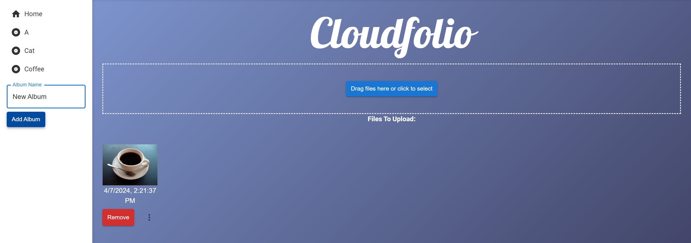

# Cloudfolio

Welcome to Cloudfolio - your personalized photo management and storage solution. Cloudfolio offers a seamless experience for uploading, organizing, and managing your photos. Access your memories from anywhere, on any device, with robust security and intuitive controls.

## Features

### Effortless Uploads
Upload photos with ease, either by dragging and dropping or selecting files. Your photos are displayed as thumbnails instantly for quick access.

### Album Creation
Organize your photos into albums with a simple click. Cloudfolio is not just about storing photos; it's about narrating your life's journey through images.

### Intuitive Organization
Move photos between albums effortlessly, ensuring your memories are organized just the way you want.

### Simplified Photo Management
Removing photos is straightforward, keeping your digital space clean and organized.

### Privacy and Sharing Controls
With Cloudfolio, you decide who gets to see your photos. Our customizable privacy settings put you in control.

## How It Works

1. **Upload**: Drag and drop or select your photos to upload.
2. **Organize**: Create albums and move photos with ease.
3. **Manage**: View, share, or remove your photos with simple controls.

## Technology Stack

Cloudfolio leverages the latest web technologies to ensure a fast, secure, and user-friendly experience:

- **React**: Powers our dynamic and responsive frontend. Components like `BrowserRouter`, `Routes`, and `Link` from `react-router-dom` enable seamless navigation and routing within the application.
- **AWS Amplify and Cognito**: Manages user authentication and authorization, providing a secure and hassle-free sign-up/sign-in experience.
- **AWS Elastic Beanstalk**: Hosts our web application, serving the frontend and handling backend API calls efficiently.
- **AWS DynamoDB**: A NoSQL database service that stores user, album, and photo information, ensuring scalability and fast access.
- **AWS Elastic Block Store (EBS)**: Offers persistent storage for image files, guaranteeing data durability and high availability.

## Deployment

Cloudfolio is deployed on AWS, taking advantage of Elastic Beanstalk for ease of deployment and scalability. Our backend REST API is also hosted here, ensuring seamless communication between the front end and our databases.

### Getting Started

To get started with Cloudfolio, simply sign up, log in, and begin uploading your photos. It's that easy!

## Comparison with Other Solutions

While solutions like Google Photos and Apple's iCloud offer cloud storage, Cloudfolio stands out with its customizable features and user-centric design. Our advanced privacy controls and personalized photo tagging make managing your digital memories a breeze.

## Future Directions

We're constantly exploring new features and technologies to enhance your photo management experience. Stay tuned for updates!
